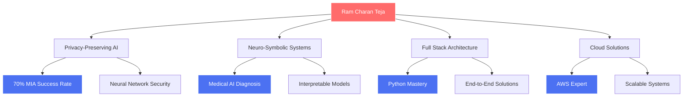

# <div align="center">🚀 RAM CHARAN TEJA 🚀</div>

<div align="center">
  
</div>

<div align="center">
  
</div>

<p align="center">
  
  
  
</p>

---

## 🔥 THE ONE WHO BREAKS THE MATRIX

```python
class RamCharanTeja:
    def __init__(self):
        self.name = "Ram Charan Teja N L"
        self.title = "AI Research Prodigy & Full Stack Architect"
        self.location = "India 🇮🇳"
        self.mission = "Building AI that preserves privacy while pushing boundaries"
        
    def current_obsession(self):
        return {
            "🧠 Neural Privacy": "Cracking SNNs with 70% MIA success rate",
            "🔬 Neuro-Symbolic AI": "Making AI explain its decisions like a doctor",
            "⚡ Full Stack Mastery": "Python to Production at lightning speed",
            "☁️ Cloud Architecture": "Scaling systems for millions"
        }
    
    def unique_superpower(self):
        return "I make AI models confess their secrets! 🕵️‍♂️"
```

---

## 🧬 ELITE RESEARCH PORTFOLIO

<div align="center">

### 🛡️ **PRIVACY WARFARE IN AI** | NIT Jaipur
*Membership Inference Attack Specialist*
```bash
$ python attack_snn.py --target "advanced_neural_networks" --success_rate 0.70
[SUCCESS] Exposed privacy vulnerabilities in neuromorphic systems
[IMPACT] Demonstrated >50% data leakage in baseline SNNs
[BREAKTHROUGH] Custom spike encoders + STDP attention mechanisms
```

### 🧠 **NEURO-SYMBOLIC FUSION** | IEEE CIS  
*Medical AI Interpreter*
```sql
SELECT diagnosis, confidence, explanation 
FROM hybrid_neural_symbolic_model 
WHERE interpretability = 'MAXIMUM' 
AND accuracy > baseline_models;
```

### 🏆 **AI RESUME INTELLIGENCE** | Alliance University
*2nd Place Victory - Beat Microsoft & CTS Judges*
```javascript
const achievement = {
    position: "2nd Place 🥈",
    competition: "National AI Hackathon",
    judges: ["Microsoft", "Reskill", "CTS"],
    innovation: "NLP-powered recruitment revolution"
};
```

</div>

---

## ⚡ TECHNOLOGICAL SUPREMACY

<div align="center">

### 🐍 **PYTHON MASTERY**


### 🗄️ **DATABASE DOMINATION**


### ☁️ **CLOUD NATIVE ARCHITECT**


### 🔧 **FULL STACK ARSENAL**


</div>

---

## 📊 PERFORMANCE METRICS

<div align="center">
  
  
</div>

<div align="center">
  
</div>

<div align="center">
  
</div>

---

## 🎯 ELITE ACHIEVEMENTS UNLOCKED

<div align="center">

| 🏆 Achievement | 🌟 Level | 🔥 Impact |
|:-------------:|:--------:|:---------:|
| **NIT Research Intern** | Legendary | Privacy AI Breakthrough |
| **IEEE CIS Fellow** | Epic | Neuro-Symbolic Pioneer |
| **IIT Bombay e-Yantra** | Rare | Innovation Champion |
| **National Hackathon 2nd** | Epic | Beat Tech Giants |
| **Azure Certified** | Pro | Cloud Architecture |
| **Advanced SQL Master** | Expert | Database Optimization |

</div>

---

## 🚀 RESEARCH IMPACT ZONE

<div align="center">
  


</div>

---

## 🎪 WHAT MAKES ME UNIQUE AMONG 8 BILLION HUMANS

<div align="center">

### 🔮 **THE PRIVACY DETECTIVE**
*I can make AI models confess what data they've seen - 70% success rate in exposing neural secrets*

### 🧠 **THE AI WHISPERER** 
*I teach machines to explain themselves like human doctors - bridging AI and interpretability*

### ⚡ **THE FULL STACK LIGHTNING**
*From neural networks to production systems - I build complete AI solutions at light speed*

### 🌊 **THE RESEARCH TSUNAMI**
*Published breakthrough research while still an undergrad - making waves in AI privacy*

</div>

---

## 🔥 CURRENT MISSION: IMPOSSIBLE

```yaml
Mission_Impossible_Status: "IN_PROGRESS"
Current_Challenges:
  - "Making SNNs leak their training secrets 🕵️"
  - "Building AI doctors that show their work 👨‍⚕️"
  - "Scaling privacy-preserving systems to millions 📈"
  - "Revolutionizing how AI explains itself 🧠"

Next_Level_Unlocks:
  - "PhD in AI Safety & Privacy"
  - "Leading AI Research Lab"
  - "Publishing in Top-Tier Conferences"
  - "Building AI that serves humanity safely"
```

---

## 🌐 CONNECT WITH THE PRODIGY

<div align="center">

[](https://www.linkedin.com/in/n-l-ram-charan-teja-ba2b25288/)
[](mailto:nlramcharanplacement@gmail.com)
[](https://ramcharanteja-22.github.io/RAM_CHARAN_TEJA/))
[](https://(leetcode.com/u/N_L_R/))

</div>

---

<div align="center">
  
</div>

<div align="center">
  
</div>